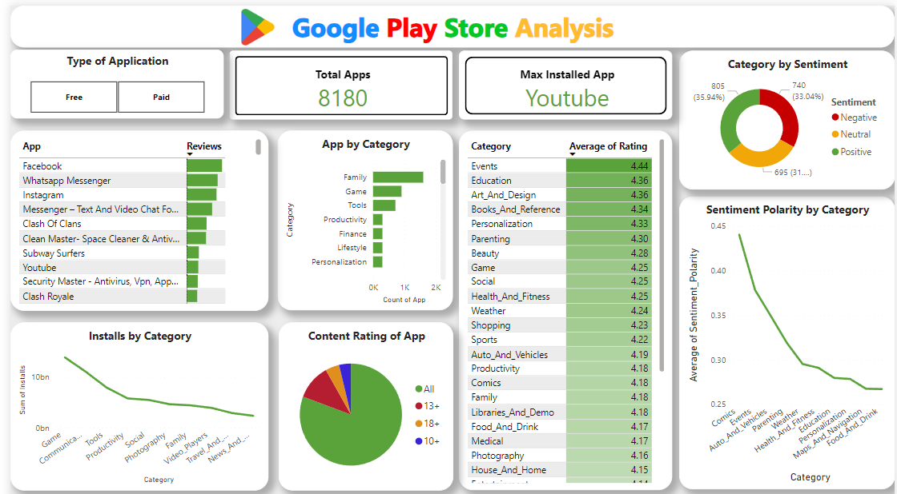

# GP_AppStore_Analysis
**Introduction**

Google Play store stands as a vibrant marketplace, hosting an extensive array of Android applications. Actionable insights can be drawn for developers to work on and capture the Android market!This dataset contains information such as names of the mobile apps from the Google Play store, categories, Android versions, Rating, Number of reviews, Number of installs, size of the app, when was last updated, and the current version of the mobile apps.
There are 2 csv files in the current version of the dataset:
- 'googleplaystore.csv'
- 'googleplaystore_user_reviews.csv

**Objective**

The primary aim of this project is to conduct a thorough analysis of the dataset to identify significant insights. 

**Dataset Descriptions of 'googleplaystore.csv'**

- App: Name of the mobile application.
- Category: Category or genre to which the app belongs.
- Rating: User rating score of the app.
- Reviews: Number of user reviews/ratings for the app.
- Size: Size of the app installation package.
- Installs: Number of times the app has been installed.
- Type: Whether the app is free or paid.
- Price: Price of the app if it's paid; otherwise, '0' or 'Free'.
- Content Rating: Content rating indicating suitability for different age groups.
- Genres: Specific genres or themes associated with the app.
- Last Updated: Date when the app was last updated.
- Current Ver: Current version of the app.
- Android Ver: Minimum required Android version to run the app.

**Dataset Descriptions of 'googleplaystore_user_reviews.csv'**

- App:Name of the mobile application
- Sentiments:classified on basis of positive, negative,neutral
- Sentiment Polarity
- Sentiment Subjectivity
- Translated Review:Description of the reviews
  
**Dashboard**

**Insights**

- the most installed category of mob app from this dataset:Youtube
- total categories of apps:33
- total paid apps:601
- Highest rating app:Events
- Most reviewed app for free-Facebook
- Most reviewed app for paid-Minecraft
- 35% displayed positive sentiments by category
